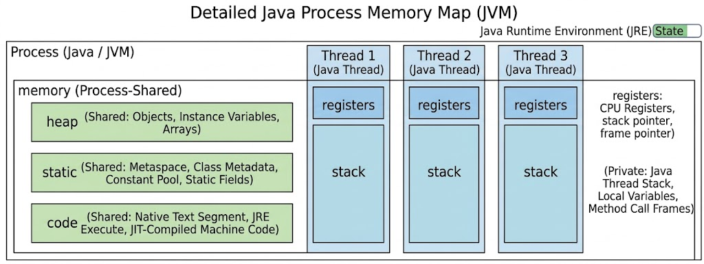
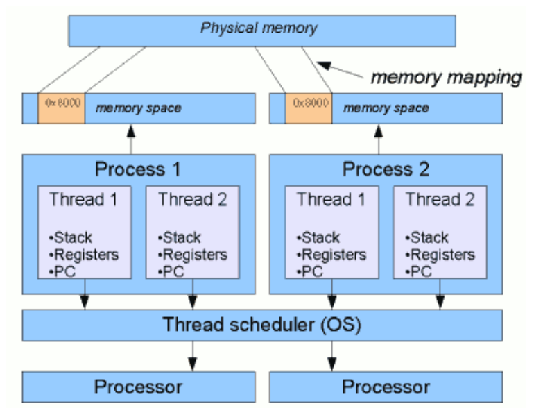
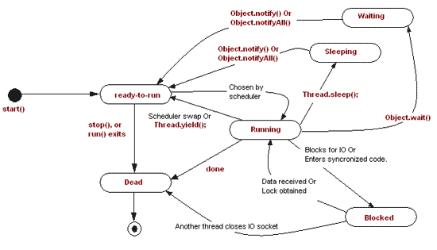
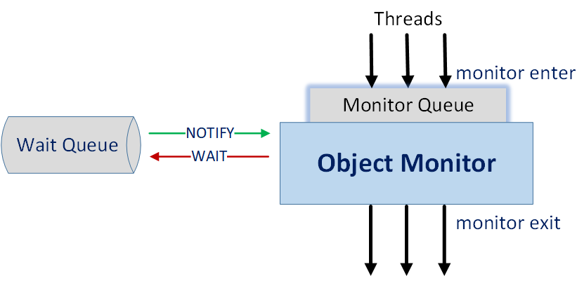
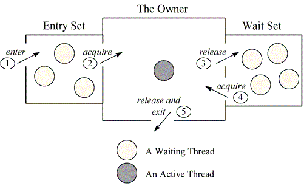
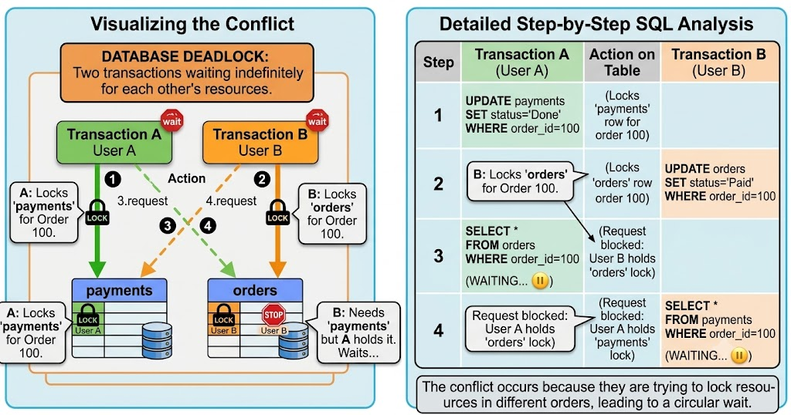
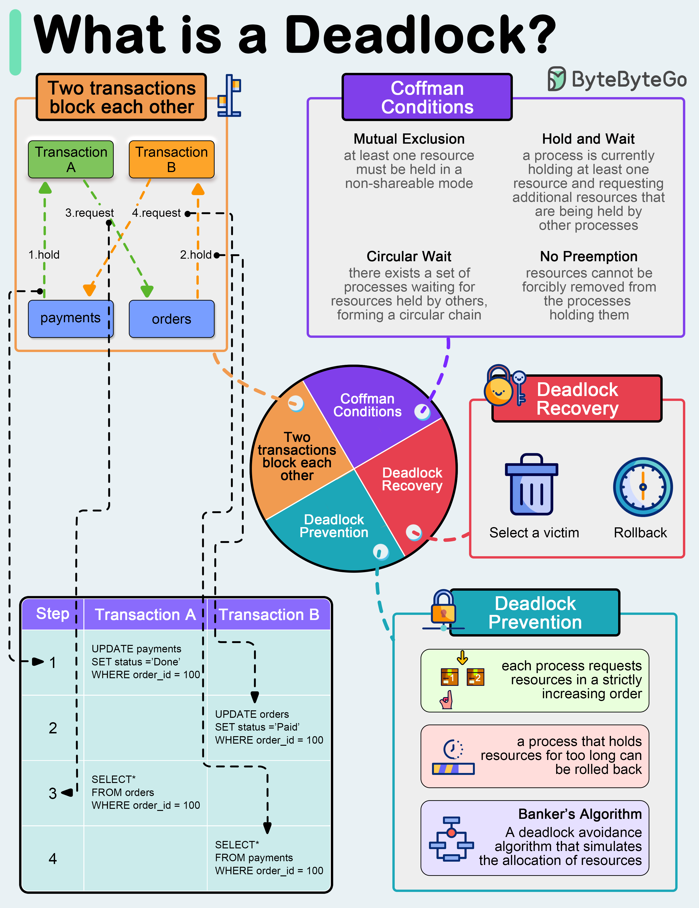

# Mulithreading

- [Mulithreading](#mulithreading)
  - [Concurrency \& Parallelism](#concurrency--parallelism)
    - [Concurrency (Structure of Program)](#concurrency-structure-of-program)
    - [Parallelism (Hardware Configuration)](#parallelism-hardware-configuration)
    - [Concurrency Vs Parallelism](#concurrency-vs-parallelism)
    - [Rob Pike's Definition](#rob-pikes-definition)
    - [Core Relationship](#core-relationship)
    - [Common Misconceptions](#common-misconceptions)
    - [Designing for Concurrency](#designing-for-concurrency)
    - [Consider the Workload Type](#consider-the-workload-type)
  - [Thread Vs Process](#thread-vs-process)
  - [Whole Picture](#whole-picture)
  - [Thread Basics](#thread-basics)
    - [Thread Creation in Java](#thread-creation-in-java)
    - [Thread Lifecyle \& States](#thread-lifecyle--states)
  - [Thread Priority](#thread-priority)
  - [Daemon Thread](#daemon-thread)
  - [Synchronization \& Locks](#synchronization--locks)
    - [Race Condition](#race-condition)
    - [`synchronized` Keyword](#synchronized-keyword)
    - [Reetrancy in synchronized](#reetrancy-in-synchronized)
    - [Intrinsic Locks and Object Monitors](#intrinsic-locks-and-object-monitors)
  - [Thread Coordination](#thread-coordination)
    - [Atomicity](#atomicity)
    - [Visibility](#visibility)
    - [Volatile keyword](#volatile-keyword)
  - [Happens-Before Relationship](#happens-before-relationship)
    - [How to establish happens-before relation?](#how-to-establish-happens-before-relation)
    - [Java Memory Model](#java-memory-model)
    - [So what is Java Memory Model?](#so-what-is-java-memory-model)
    - [Summary](#summary)
  - [Thread Coordination](#thread-coordination-1)
    - [`obj.wait()` `obj.notify()` `obj.notifyAll()`](#objwait-objnotify-objnotifyall)
    - [Spurious Wakeups](#spurious-wakeups)
    - [`obj.sleep()`](#objsleep)
    - [`sleep()` vs `wait()`](#sleep-vs-wait)
  - [Thread Interruption](#thread-interruption)
  - [Thread Join (Wait for another thread)](#thread-join-wait-for-another-thread)
    - [`obj.join()`](#objjoin)
  - [Thread Yield (Giveup CPU for another thread)](#thread-yield-giveup-cpu-for-another-thread)
    - [`obj.yield()`](#objyield)
    - [`join()` vs `yield()`](#join-vs-yield)
  - [Concurrency Problems](#concurrency-problems)
    - [Deadlock](#deadlock)
    - [Stravation](#stravation)
    - [Livelock](#livelock)
    - [ThreadSafe](#threadsafe)
    - [ThreadLocal](#threadlocal)
  - [Java Locks](#java-locks)
  - [Synchronization Utilities](#synchronization-utilities)
  - [Atomic \& Lock-Free Programming](#atomic--lock-free-programming)
  - [Callable \& Future](#callable--future)
  - [ForkJoin Framework](#forkjoin-framework)
  - [Modern Java Concurrency](#modern-java-concurrency)

## Concurrency & Parallelism

### Concurrency (Structure of Program)


- Concurrency is the ability of a system to handle multiple tasks during overlapping time periods not at same time.
- Concurrency means **structuring** a program so that multiple tasks
  can make progress. The tasks might not execute simultaneously, but the **program is
  organized to handle them in an interleaved fashion.**
- Concurrency — one CPU, multiple tasks in progress.
- **Benefits** : Better Resource Utilization, High Responsiveness since not holding on single task, Increase throughput for I/O bound workloads naturally with single cpu, increase for CPU-bound workloads with parallelism(multiple CPU)
- Challenges:
  - Non-Determinism : A concurrent program has **multiple possible execution orders.** Different execution order can produce different results, even with identical inputs. This non-determinism makes concurrent programs hard to reason about.The bug might appear once in a thousand runs, only in production, only under load.
  - Race Conditions : A race condition **happens when non-determinism leads to an incorrect outcome**. It specifically occurs when two or more threads access shared memory concurrently, at least one of those accesses is a write, and there is no proper synchronization (like locks or mutexes) to enforce order.
  - Deadlocks : A deadlock occurs when two or more threads are **waiting for each other for a lock**, and none can proceed. Deadlocks don't corrupt data like race conditions. Instead, the **program simply stops making progress**. In production, this often manifests as a service becoming unresponsive under load.
  - Debugging Difficulty : Concurrent bugs are **notoriously hard to find** because:
    - They are **intermittent**: The bug only appears under specific timing conditions.
    - Observation changes behavior: Adding print statements or attaching a debugger changes timing, potentially making the bug disappear.
    - This is called a "heisenbug," a bug that seems to disappear when you try to observe it (named after Heisenberg's uncertainty principle).
  - Complexity : Even without bugs, concurrent code is**harder to understand than sequential code** since You need to think about:
    - What data is shared between threads?
    - What synchronization protects that data?
    - What happens if thread A runs before thread B? What about the reverse?
    - Can these operations be reordered by the compiler or CPU?

  - This mental overhead increases the cognitive load on developers and reviewers.

<details>
<summary>Non-Determinism & Race Condition</summary>

They are closely related, but they are not the same thing. **Non-determinism is a broad concept, while a race condition is a specific defect.**

- **Non-Determinism (The Nature of Concurrency):** This is a neutral characteristic of concurrent systems. It simply means that given the exact same input, a program can take different execution paths or timing orders because of thread scheduling, network latency, or hardware state. Non-determinism isn't inherently a bug—a correctly synchronized concurrent program can be non-deterministic in its thread execution order while still reliably producing the correct answer every single time.
- **Race Condition (The Bug):** This is an actual flaw in the program's logic. A race condition happens when non-determinism leads to an incorrect outcome. It specifically occurs when two or more threads access shared memory concurrently, at least one of those accesses is a write, and there is no proper synchronization (like locks or mutexes) to enforce order.

**Summary**
Non-determinism creates the unpredictable environment in which race conditions can hide. Non-determinism is the **behavior**; a race condition is the **bug** that happens when that behavior causes your program to fail.

</details>

### Parallelism (Hardware Configuration)


- Using multiple CPUs (or cores), multiple tasks literally executing at the same instant. Task A runs on Core 1 while Task B runs on Core 2 simultaneously.
- Parallelism is about execution. It's multiple tasks literally running at the same instant on different processors or cores.

### Concurrency Vs Parallelism

- parallelism implies concurrency, but **concurrency doesn't require parallelism**. If two tasks run in parallel, their time windows obviously overlap (concurrent). But concurrent tasks don't need multiple cores — a single core switching between them is enough.
- A program can be concurrent without running in parallel but A **program cannot run in parallel unless it's structured to be concurrent**. Parallelism requires multiple independent tasks, which means the program must first have concurrent structure**otherwise one gaint task running on one of the core even 4 cores available.**

### Rob Pike's Definition

- Concurrency is about dealing with lots of things at once. Parallelism is about doing lots of things at once.
  - You can write a concurrent program that never runs in parallel (single core).
  - You cannot write a parallel program that isn't concurrent (you need multiple tasks to parallelize).

### Core Relationship

> > Concurrency is necessary for parallelism, but not sufficient.( Need H/w )

- To get parallelism, you need concurrency plus hardware (multiple cores/CPUs).

- "Necessary" — You can't run things in parallel if your code isn't even structured for multiple tasks. You need concurrency first.

- "Not sufficient" — Just because your code can juggle multiple tasks doesn't mean the hardware will run them simultaneously. A single-core machine will still interleave them.

**So: concurrency = the design. Parallelism = the execution. You need the right design, but you also need the right hardware. Design alone isn't enough — that's why it's not sufficient.**
So just because I have multiple core CPU, my code will be not be parallelized (code need to be concurrent)

### Common Misconceptions

- Misconception 1: "Concurrent means parallel"
  - Not quite. A concurrent program can run on a single core, where tasks are interleaved but never truly run parallel.
- Misconception 2: "Adding more threads always helps"
  - More threads do not automatically mean more speed.
  - For CPU-bound work on a 4-core machine, running far more than 4 active threads often just **increases context-switching and scheduling overhead.**
  - **For I/O-bound workloads, extra threads can help hide waiting time**, but adding threads helps up to a point, **but infinite threads won't give infinite speedup** beacuse memory limit and context switching overhead.
- Misconception 3: "Parallel is always faster"
  - Not necessarily. Parallelism has overhead:
    - Thread creation and management
    - Synchronization and communication
    - Cache coherency traffic
    - Amdahl's Law limits
  - For **small tasks, that overhead can outweigh the benefit**. In some cases, the fastest solution is the simplest one: run it sequentially.

### Designing for Concurrency

1. Identify Independent Tasks - the more independent the tasks are, the more parallelism you can unlock.
2. Minimize Shared State - Every synchronization point becomes a bottleneck that serializes execution and reduces parallelism.
   - Shared, mutable state forces you to add synchronization (locks, atomic operations, coordination)
3. Use Appropriate Granularity - Task size matters.
   - If tasks are too small, overhead (scheduling, context switches, coordination) can outweigh the benefit.
   - If tasks are too large, you cannot distribute work evenly, and some workers sit idle.

### Consider the Workload Type

Different workloads benefit from different approaches.

| Workload      | Strategy                                                    |
| :------------ | :---------------------------------------------------------- |
| **I/O-bound** | Concurrency matters most; async often helps                 |
| **CPU-bound** | Parallelism matters most; scale up to core count            |
| **Mixed**     | Split into I/O and CPU phases, and optimize each separately |

## Thread Vs Process

- Process is an **instance of a program** with its own address space, stack and heap. A process might have multiple threads within but it will at least have one thread.
- All the **threads of a process will have individual stacks but they will share the heap.**
  > > Java is Process which have heap memory and threads share it in common.
- If a process has only one thread it can only use one core. Most modern CPUs have 8 to 64 cores – so, if you do multithreading – each of those threads can run on multiple cores and hence take advantage of more resources and the program can be efficient.



## Whole Picture

> > JVM is one of the process, other process can be Posgres, RabbitMQ, Chrome Etc..
> > Each process designated allocated memeory and os thread scheduler decides which one to run in processor.



## Thread Basics

### Thread Creation in Java

- extend `Thread` class and override `run()` method. &harr; Creating Worker
- implement `Runnable` and create a task by implementing `run()` and handover to `Thread` class. &harr; Creating Task.

```java
Thread t = new Thread(() -> System.out.println("Lambda thread running"));
t.start();
```

- `t.start()`
  - registers thread with JVM scheduler, low level activities like native OS thread creation, call stack allocation etc. and creates new thread which will internally calls run() method
  - a thread can be only used once i.e cannot call `t.start()` method again.

### Thread Lifecyle & States

> > Each State of threads tells you what going inside JVM.



1. `NEW` - **Thread object has been created in heap**, but .start() has not been called.
2. `RUNNABLE` - after `start()`, thread ready to run
3. `RUNNING` - thread actually executing code in CPU. (CPU switch between runnable and running based on its available resource, priority of other process, concurrency)
4. `WAITING` - indefinite waiting untill another thread notifies
5. `TIMED_WAITING` - wait for fixed amount of time (sleep)
6. `BLOCKED` - when thread tries to enter synchronized method or block but another thread already inside, then thread gets **blocked state until the lock is free.**
7. `TERMINATED` - thread finished execution, cannot be restarted.

## Thread Priority

- `t.setPriority(1-10)` Higher priority thread **gets more CPU cycles (time)**
- hint to JVM and OS (not guranteed), so based idea to rely on. (1 : lowest / 10: Highest Priority)
- Because **OS schedulers vary across operating systems** and can ignore or override thread priorities, you should never rely on Thread.setPriority() for program correctness or precise execution timing.
- Instead, **rely on deterministic synchronization and concurrency primitives provided by java.util.concurrent.**

## Daemon Thread

- backgroung helper thread for user threads. E.g. Garbage Collector is Daemon thread.
- When all user threads finish, JVM will exist even if daemon thread are still running.
- `t.setDaemon(true)` : should be set before calling start()

## Synchronization & Locks

### Race Condition

- two or more threads trying to acesss and**modify shared data at same time.**
- **results depend on timing of thread execution** which will produce **unpredictable bugs** which are hard to reproduce.

  > > Fix : Synchronization

### `synchronized` Keyword

- every object have monitor lock (since each object is a resource which have data and functions that do some thing) which synchronized keyword acquires that lock before entering and release it when existing.
- other threads will be in blocked state until current thread releases the lock.
- prevents data inconsistency but reduce performance due contention (fighting to claim lock).
- Avoid over synchronization can risk bottle neck and even deadlock.
- Types
  - synchronized instance method (object lock)
  - synchronized static method (class lock which is in class meta data)
  - synchronized block with this or dedicated lock object since everybody can take shared object and come for the resource.

```java
// Demonstration of using a Private Dedicated Lock object vs. Public/This locking

public class Counter {
    private int count = 0;

    /*
     * ISSUE WITH "synchronized(this)" OR SYNCHRONIZED METHODS:
     * If you write `synchronized(this)`, any external code holding a reference
     * to `counter` can also execute `synchronized(counter)`.
     * An external caller could accidentally or maliciously acquire this lock
     * and block `increment()` from executing, causing a deadlock or performance bottleneck.
     *
     * SOLUTION - PRIVATE DEDICATED LOCK:
     * We create an internal, private lock object.
     * Because it is 'private', external code CANNOT see or acquire this lock.
     * Because it is 'final', the lock reference cannot accidentally be changed.
     */
    private final Object lock = new Object();

    public void increment() {
        // Only internal methods inside Counter can synchronize on 'lock'
        synchronized (lock) {
            count++; // Thread-safe state mutation
        }
    }

    public int getCount() {
        // Read operations should also use the same private lock for visual consistency
        synchronized (lock) {
            return count;
        }
    }
}
```

### Reetrancy in synchronized

- synchronized keyword in reetrant, once acquired it can access other locked method otherwise it will become self deadlock as waiting for a lock which it already has.

### Intrinsic Locks and Object Monitors

- every Object hide inside intrinstic lock (monitor lock), threads must acquire or wait until other threads release.
- Intrinsic Locks comes with monitor mechanism that allow threads to communicate
  - `wait()` - release lock and waiting for another thread signal to wakeup.
  - `notify()` or `notifyAll()` - wakeup waiting thread.

```java
public class QuickWaitNotify {
    private static final Object lock = new Object();

    public static void main(String[] args) throws InterruptedException {
        Thread worker = new Thread(() -> {
            synchronized (lock) {
              //enter wait state on same object
                try { lock.wait(); } catch (InterruptedException e) { return; }
                System.out.println("Worker thread resumed!");
            }
        });
        worker.start();
        Thread.sleep(500); // Wait for worker to enter wait state
        synchronized (lock) { lock.notify(); } // Signal worker to wake up on same object
    }
}
```



## Thread Coordination

### Atomicity

- threads should be able to complete the update fully or fail it completely (no partial update)

> > Fix : Synchrnosiation or AtomicInteger to avoud read write cycle

### Visibility

- Other threads should see the latest value and not cached value

> > Fix : Volatile keyword

- `synchronized` Keyword solve both when same lock is being used by other thread which wants see latest value.`synchronized` flushed data from cache to main memeory

### Volatile keyword

- must always read and write to main memory but not atomic writes
- volatile doesnot have any lock but synchronized is heavier

**Usecases**

1. Volatile : Flags, Static Variables, Simple Read/Write Sharing
2. Synchronized : Counter, Collections or Multistep logic

## Happens-Before Relationship

> > Happens-before defines a partial ordering on all actions within the program

- Happens-before relationship is a guarantee provided by Java that action performed by one thread is visible to another action in different thread.
- **Happens-before defines a partial ordering on all actions within the program. T**o guarantee that the thread executing action Y can see the results of action X (whether or not X and Y occur in different threads), there must be a happens-before relationship between X and Y.
- In the absence of a happens-before ordering between two operations, the **JVM is free to reorder** them as it wants (JIT compiler optimization).
- Happens-before is not just reordering of actions in 'time' but also a guarantee of ordering of read and write to memory .
  - Two threads performing write and read to memory can be consistent to each other actions in terms of clock time but might not see each others changes consistently (Memory Consistency Errors) **unless they have happens-before relationship.**

### How to establish happens-before relation?

- Single thread rule: Each action in a single thread happens-before every action in that thread that comes later in the program order.
- Monitor lock rule: An unlock on a monitor lock (**exiting synchronized method/block**) happens-before every subsequent **acquiring on the same monitor lock.** (Another person gets same lock, enters see the latest value)
- Volatile variable rule: A write to a volatile field happens-before **every subsequent read of that same field.** Writes and reads of volatile fields have similar memory consistency effects as entering and exiting monitors (synchronized block around reads and writes), but without actually aquiring monitors/locks. (threads always see latest value since read from main memory)
- Thread start rule: thread.start() happended before all statements in thread.run()
- Thread join rule: finishing of join() method heappended before all statements after join()
- Transitivity: If A happens-before B, and B happens-before C, then A happens-before C.

### Java Memory Model

**Why JMM?**

1. Variable Visiblity Problem
2. Code Reordering
3. Sequential Consistency will ruin performance (but java selectively offers inside synachroied area)

### So what is Java Memory Model?

According to Java Memory Model specs:

A program must be correctly synchronized to avoid reordering and visibility problems.

A program is correctly synchronized if:

Actions are ordered by happens-before relationship.
Has no data races. Data races can be avoided by using Intrinsic Locks.

### Summary

As long as you follow the JMM rules in Java (e.g., using synchronized or volatile correctly), the JVM and JIT compiler take on the responsibility of translating those rules into the specific assembly code and memory barriers required by whatever CPU your application happens to run on. You focus on high-level Java constructs, while the JVM handles hardware complexity.

## Thread Coordination

### `obj.wait()` `obj.notify()` `obj.notifyAll()`

- when thread wants to go waiting state and must be called inside synchronised block.
- `wait()` release lock unlike `sleep(ms)`, `join()`, `yield()` and thread waits until `notify()` called on same object.
- `notify()` and `notifyAll()` : wakes thread/all threads but threads should acquire locks.



```java
synchronized (shared) {
    while (!condition) {
        shared.wait(); // releases lock, waits
    }
    // do work when condition is true
}

synchronized (shared) {
    condition = true;
    shared.notify(); // wake up one waiting thread
}
```

### Spurious Wakeups

- threads sometimes wakeup without beign notified (Rate but present in Java Specs).

```java
// Incorrect: using if
synchronized (queue) {
    if (queue.isEmpty()) {
        queue.wait(); // wakes up randomly
    }
    queue.remove(); // may throw NoSuchElementException
}

// Correct Way with while

// Correct: using while
synchronized (queue) {
  // Even threads wakeup, we will check and condition again put in wait state(whether wakeup from notify() or spurious wakeup)
    while (queue.isEmpty()) {
        queue.wait();
    }
    queue.remove(); // safe now
}
```

### `obj.sleep()`

- stop working for sometime : Running -> Timed Waiting -> Runnable(Ready Again)

### `sleep()` vs `wait()`

| Feature           | `Thread.sleep()`                                        | `Object.wait()`                                                                                       |
| :---------------- | :------------------------------------------------------ | :---------------------------------------------------------------------------------------------------- |
| **Method Type**   | Static method of `Thread` class                         | Instance method of `Object` class                                                                     |
| **Lock Handling** | Doesn't release lock when inside a `synchronized` block | Releases lock, allowing other threads to acquire it                                                   |
| **Waking Up**     | Wakes up automatically after time or if interrupted     | Needs `notify()` or `notifyAll()` from another thread using this same object now (or spurious wakeup) |
| **Use Case**      | Good for pauses, retry scheduling, and throttling tasks | Good for inter-thread communication                                                                   |

## Thread Interruption

- asaasdasdasdsad

```java
class WorkerThread extends Thread {
    public void run() {
        while (!isInterrupted()) { // Case 2: Checking the flag in a running loop
            try {
                System.out.println("Working...");
                Thread.sleep(2000); // Case 1: Thread goes to sleep
            } catch (InterruptedException e) {
                // Catching InterruptedException clears the flag and lets us exit gracefully
                System.out.println("Interrupted while sleeping! Cleaning up and exiting...");
                break;
            }
        }
    }

    public static void main(String[] args) throws InterruptedException {
        WorkerThread worker = new WorkerThread();
        worker.start();

        Thread.sleep(1000); // Let worker start
        worker.interrupt(); // Sends interrupt signal (sets the interrupted flag)
    }
}
```

**How it works:**

1. interrupt() sets the internal boolean flag on worker to true.

2. Case 1 (Sleeping/Waiting): Because the thread is in Thread.sleep(2000), Java immediately wakes it up and throws InterruptedException.

3. Case 2 (Running): If it were actively processing work instead of sleeping, while (!isInterrupted()) checks the flag manually to stop execution smoothly. |

## Thread Join (Wait for another thread)

### `obj.join()`

```java
public class JoinInterruptExample {
    public static void main(String[] args) {

        // Thread B: Long-running task
        Thread worker = new Thread(() -> {
            try { Thread.sleep(5000); } catch (InterruptedException ignored) {}
        });

        // get reference on current thread
        Thread mainThread = Thread.currentThread();

        // Interrupt main thread after 1 second using external thread
        new Thread(() -> {
            try { Thread.sleep(1000); } catch (InterruptedException ignored) {}
            mainThread.interrupt();
        }).start();

        worker.start();

        try {
            worker.join(); // Main thread blocks here until worker finishes (run method in Thread B) OR mainThread is interrupted
        } catch (InterruptedException e) {
            System.out.println("Main thread interrupted while waiting in join()!");
        }
    }
}
```

## Thread Yield (Giveup CPU for another thread)

### `obj.yield()`

```java
public class YieldExample {
    public static void main(String[] args) {
        Runnable task = () -> {
            for (int i = 1; i <= 3; i++) {
                System.out.println(Thread.currentThread().getName() + " - Count: " + i);

                // Pause current thread execution to give other threads a turn
                if ("Thread-0".equals(Thread.currentThread().getName())) {
                  //By targeting Thread-0 specifically, it forces only one thread to pause, making it obvious when Thread-1 jumps ahead in the console logs.
                    Thread.yield();
                }
            }
        };
        Thread t1 = new Thread(task, "Thread-0");
        Thread t2 = new Thread(task, "Thread-1");

        t1.start();
        t2.start();
    }
}
```

### `join()` vs `yield()`

| Feature      | `join()`                                                  | `yield()`                                                                               |
| :----------- | :-------------------------------------------------------- | :-------------------------------------------------------------------------------------- |
| **Purpose**  | Allows one thread to wait for another thread's completion | Hint to thread scheduler that the current thread is willing to pause and let others run |
| **Behavior** | "Stick with me until I'm done"                            | "I will step aside"                                                                     |
| **Usage**    | Use when you want to ensure strict ordering               | Use for voluntary pauses to give other equal-priority threads a turn                    |

## Concurrency Problems

### Deadlock



**The Root Cause: Inconsistent Lock Ordering**

- The core issue isn't necessarily that they are processing the same order (order_id = 100), but that there is no standardized lock order:

- Transaction A's Order: Locks payments first, then tries to lock orders second.

- Transaction B's Order: Locks orders first, then tries to lock payments second.

**Coffman's Conditions**

- They define the necessary and sufficient conditions for a deadlock to happen.
- All 4 conditions MUST exist at the same time for a deadlock to even be possible.
- If you break or eliminate just one of these 4 conditions in your code architecture, a deadlock becomes **mathematically impossible.**

**4 Coffman Conditions**

1. Mutual Exclusion: Resources cannot be shared; only one thread holds a resource at a time.
2. Hold and Wait: A thread holding a resource is allowed to request and wait for additional resources.
3. No Preemption: A resource cannot be forcibly taken away from a thread holding it; the thread must release it voluntarily.
4. Circular Wait: A closed chain of threads exists where Thread 1 waits for Thread 2, Thread 2 waits for Thread 3... and Thread $N$ waits for Thread 1.

**How Developers Prevent Deadlocks**

Since all 4 conditions must exist together for a deadlock to happen, you only need to break one:

1. Prevent Circular Wait (Most Common): Always acquire locks in a strict, uniform order (e.g., always lock Resource A before Resource B everywhere in your codebase).

2. Prevent Hold & Wait: Acquire all required locks at once before starting the task, or release held locks before requesting new ones.

3. Prevent No Preemption: Use timeout-based locking mechanisms like ReentrantLock.tryLock(timeout) instead of infinite block locks (synchronized). If a thread can't get the next lock, it drops its current locks and tries again later.

<details>
<summary> Byte Byte Go </summary>



</details>

---

### Stravation

### Livelock

### ThreadSafe

### ThreadLocal

## Java Locks

## Synchronization Utilities

## Atomic & Lock-Free Programming

## Callable & Future

## ForkJoin Framework

## Modern Java Concurrency

- partial ordering on instruction since concurrent we cannot do total ordering
- <https://web.goodnotes.com/s/NGiA9uSx4H4YE7FArjqVvN>
- physical notes
  <https://www.logicbig.com/tutorials/core-java-tutorial/java-multi-threading/happens-before.html>
